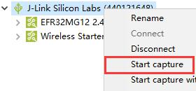

[back](../README.md)

# 网络抓包入门

环境变量：

* Windows 10
  * Simplicity Studio 4
    * Network Analyzer
* EFR32™ Mighty Gecko Wireless Starter Kit (SLWSTK6000B)
  * BRD4161A Rev A02 (EFR32MG12P432F1024GL125)
  * BRD4001A Rev A01

Simplicity Studio 4 内置了一个 Network Analyzer 工具，该工具用于网络分析。EmberZNet 支持 PTI（PacketTrace interface），这允许 Simplicity Studio 在不干扰节点运行的情况下查看网络上的消息。

> 注：PTI 的具体介绍可以参阅官方文档：**UG103.4: Application Development Fundamentals: HAL**。

本文假定读者已经构建了一个基本网络。

# 构建带 PTI 的示例应用

构建示例应用的详细步骤可以参考 [构建示例应用 Z3Light](../build-sample-app-z3light/README.md)，本文亦以 Z3Light 为例。

> 注：默认情况下，示例应用 Z3Light 已开启了 PTI 模块，不必手动打开。

打开 PTI 模块：

1. 打开项目的 `*.isc` 文件，选中 `HAL` 选项卡 ，并点击 `Open Hardware Configurator`  进入到硬件配置器页面。
2. 点击其中的 `DefaultMode Peripherals`，进入到外设模式。 
     
3. 勾选 `PTI`，并在 `Properties` 中配置好 PTI 模块。 
    
4. 点击保存并构建项目。
5. 将构建好的固件烧录到设备上。

# 使用 Network Analyzer

1. 将烧录好的设备连接到主机上，在 `Debug Adapters` 中右键设备，并点击 `connect`。 
    
2. 再次右键设备，选择 `Start capture`。 
    
3. 页面将跳转到 `Network Analyzer` 中，并且能观察到已捕抓到一些消息，但是由于没有密钥，所以无法解析出消息的内容。 
    
4. 将设备加入到网络中。
    > 注：可以参考 [初试 CLI](../first-try-cli/README.md)。
5. 在设备上使用 CLI 命令 `keys print`，将网络密钥打印出来，并复制其中的网络密钥。 
    
6. 在菜单栏中，选择 `Windows > Preferences`。 
    
7. 选择 `Network Analyzer > Decoding > Security Keys`，并点击 `New`。 
    
8. 将网络密钥黏贴到新建的项中，并点击 `OK`。 
    
9. 此时，可以发现捕抓到的消息被正确地解析出来。
    
